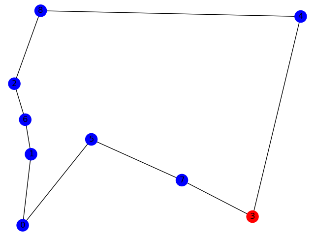

=================================================
Solving a Traveling Salesman Problem by hybrid_v1 
=================================================

A demo on using the D-Wave Ocean SDK to solve the Traveling Salesman Problem. 
Given a set of cities, find the shortest route for a salesman to visit all cities once and return to the starting city.

In the figure above, the origin city is shown in red and the others are in blue.
The lines represent the route of travel.

We use `Leap's Hybrid Solver <https://docs.dwavesys.com/docs/latest/c_solver_3.html>`_ (hybrid_v1), which is intended to solve arbitrary application problems formulated as BQM, to solve this problem.
This solver implements cutting edge classical algorithms together with QPU and can accommodate very large problems.

Usage
-----

A simple command that runs the demo. For example,

.. code-block:: bash

  python traveling-salesman-problem.py

Code Overview
-------------

To solve this problem, we should express the problem with a cost function in the QUBO format.
Our goal is to find the optimal route with the least travel distance, so a cost function represents total travel distance on a route.
Also, there are some constraints to be satisfied.

* Visit all cities once
* Visit only one city at the same time

Using `PyQUBO <https://pyqubo.readthedocs.io/en/latest/>`_, the cost function including these constraints can get converted to a QUBO matrix.
Then we can submit it to hybrid_v1 solver and the solver hopefully return the solution to our problem.

Code Specifics
--------------

The core code for Traveling Salesman Problem lives in ``traveling_salesman_problem.py``, so the following sections describe that code.

Problem setting
~~~~~~~~~~~~~~~
We should define the following two variables to set the problem to be solved.

* ``positions (dict)``, containing information of the coordinates of each city
* ``origin (int)``, indicating the index of the origin city

First, let N be the number of cities and assign an index from ``0`` to ``N-1`` to each city.
It has been confirmed that a good solution can be obtained if N is up to about 10.
The dictionary ``positions`` has a city index in the key and x, y coordinate of a city in tuple form in the value as shown below.
In this demo, the coordinates of each city are randomly determined in a range of 0 to 500.
So you can rewrite this dictionary according to the target problem.

.. code-block:: bash

  positions = {0: (x_0, y_0), 
               1: (x_1, y_1), 
               ..
               N-1: (x_N-1, y_N-1)}

Then store the starting city index in the variable ``origin``.
It is selected at random in that code so you can change the variable definition if necessary.

After describing the problem setting calculate the distances between each city and store them in the matrix ``distances``.

Problem formulation
~~~~~~~~~~~~~~~~~~~
To submit the problem to the solver, we should express it in QUBO.
Use binary variables ``q[i][t]`` that take 1 if visiting city with index ``i`` at time ``t``, 0 otherwise.

In this problem, the order of each term of the objective function tends to be large, so we define the normalization function ``normalize(exp)``.

The first term ``exp_origin`` expresses the distance from the start point to the next city, the last city to the endpoint that is origin point.
And ``exp_others`` shows the total distance from the current city to the next city.
So ``H_cost`` is represented by the normalized sum of ``exp_origin`` and ``exp_others``.

Next, describe two constraints.
``H_city`` expresses the first constraint above and ``H_time`` states the second constraint.
``Placeholder('lam')`` is for the coefficient of constraint terms and you can change the value of it later without compiling again.

Then the objective function is written as

.. code-block:: bash

  H = H_cost + Placeholder('lam') * (H_city + H_time)

Solve QUBO and Visualize the result
~~~~~~~~~~~~~~~~~~~~~~~~~~~~~~~~~~~
Determine the coefficient of the constraint term (here to 5) and obtain a QUBO matrix by ``model.to_qubo``.
We adopt hybrid_v1 as the solver and submit the QUBO to it, and get a response.
Use ``model.decode_solution`` of PyQUBO to check if the sample obtained from the response satisfies the constraints.
The sample meets the constraints in most cases by using the solver hybrid_v1.

Then visualize the result by Matplotlib package.
In an array ``order``, the indices of the cities are stored in the traveling order based on the sample of the solution.
According to this array, we plot a two-dimensional array with the city on the vertical axis and the order on the horizontal axis.
And add edges to graph G and draw a route indicated by the solution.

Even if the result obtained from the solver is not the optimum solution, it is possible to obtain a better solution by visualizing it like the figure above and making fine adjustments.

License
-------

Released under the Apache License 2.0. See `LICENSE <LICENSE>`_ file.
